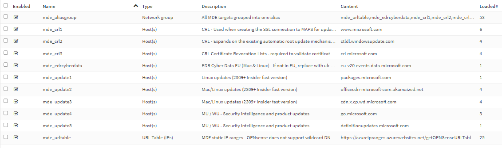

# MDE-Streamlined-OPNsense

OPNsense aliases for MDE Streamlined connectivity method:
* **MDE IPs for Core MDE services** - Static IP ranges that can be used as alternative to the URLs. OPNsense does not support wildcard URLs in firewall rules so we need to use the IP list.
* **MDE URLs for EDR Cyber Data, CRL, Updates** - this includes the Required URLs with the exception of SmartScreen (which is a wildcard URL).

Contains the following aliases:

In firewall rules you can use the group **mde_aliasgroup** as target to allow connections.

# References

Onboarding devices using streamlined connectivity for Microsoft Defender for Endpoint:

https://learn.microsoft.com/en-us/microsoft-365/security/defender-endpoint/configure-device-connectivity?view=o365-worldwide

Official streamlined URL list:

https://view.officeapps.live.com/op/view.aspx?src=https%3A%2F%2Fdownload.microsoft.com%2Fdownload%2Fe%2Fc%2F9%2Fec9e81cd-b39a-4d4c-afac-ff64cfe872ad%2Fmde-streamlined-urls-commercial.xlsx&wdOrigin=BROWSELINK
